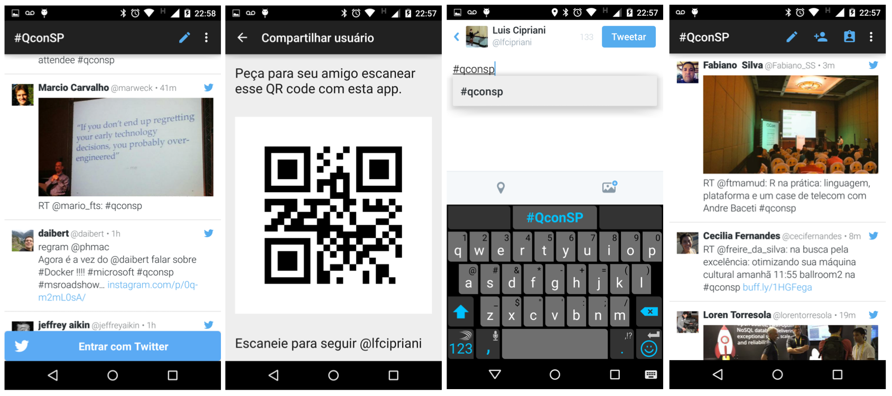

# Live Event Android

A sample Live Event utility app to help your participants to follow what's happening.

A sample from Qcon Sao Paulo

## Features

* Event hashtag timeline
* Create a tweet with event hashtag pre-filled
* Follow other participant by scanning a QR code (in the app or printed on conference badge)
* Share your user handle QR Code to someone
* Follow event organizer accounts

## Fabric features

This app uses the following Fabric features:

* Crashlytics
    * Custom keys
    * Caught Exceptions
    * User identification
    * Log
    * Beta
* Twitter Kit
    * Guest Authentication
    * TweetComposer
    * Sign in with Twitter
    * Native embedded timelines
    * Twitter API calls
    * Twitter API client extension
* Answers

## Building

If you want to run the app locally, do the following:

1. Import the project in your IDE (we use gradle to build)
2. If you don't have a Fabric account
    1. Sign up at fabric.io
	2. Install Fabric IDE plugin
	3. Rename `app/crashlytics.sample.properties` to `app/crashlytics.properties`
    4. Fill in your keys there
3. If you have a Fabric account
    1. Rename `app/crashlytics.sample.properties` to `app/crashlytics.properties`
    2. Fill in your keys there
4. Customize the `strings.xml` file with your event hashtags and search criteria
5. Run it

See [how to integrate the SDK](https://dev.twitter.com/twitter-kit/android/integrate) if you need more help.

## Get support

If you need support to build the app or to understand any part of the code, let us know. Post your question at [Twitter Community](https://twittercommunity.com/c/mobile) forum.

## Contributing

The goal of this project is to be an example for Fabric and we strive to keep it simple. We definitely welcome improvements and fixes, but we may not merge every pull request suggested by the community.

The rules for contributing are available at `CONTRIBUTING.md` file.

## Contributors

* [Luis Cipriani](https://twitter.com/lfcipriani)

## License

Copyright 2015 Twitter, Inc and other contributors.

Licensed under the Apache License, Version 2.0: http://www.apache.org/licenses/LICENSE-2.0
